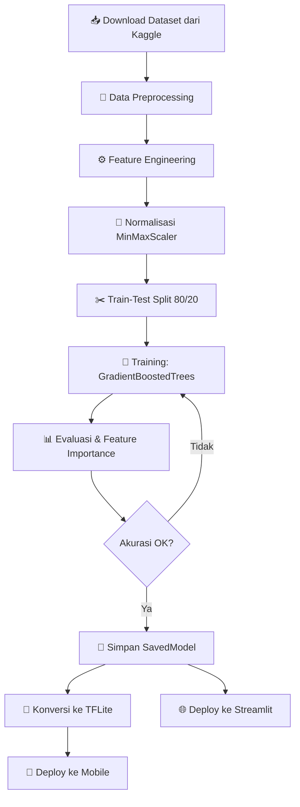

<div align="center">

# 🧒 DeteksiStuntingML

### Machine Learning Application for Child Stunting Detection

[](https://www.python.org/)
[](https://tensorflow.org/)
[](https://streamlit.io/)
[](LICENSE)

<p align="center">
  
  
  
</p>

> **Deteksi dini stunting pada anak menggunakan Machine Learning berbasis Gradient Boosted Trees — prediksi cepat, akurat, dan siap deploy ke web maupun mobile.**

</div>

---

## 📋 Daftar Isi

- [📖 Tentang Proyek](#-tentang-proyek)
- [✨ Fitur Utama](#-fitur-utama)
- [🛠️ Tech Stack](#️-tech-stack)
- [📊 Dataset](#-dataset)
- [🤖 Model & Arsitektur](#-model--arsitektur)
- [🚀 Instalasi & Penggunaan](#-instalasi--penggunaan)
- [📁 Struktur Proyek](#-struktur-proyek)
- [🎯 Cara Kerja Aplikasi](#-cara-kerja-aplikasi)
- [📈 Alur Machine Learning](#-alur-machine-learning)
- [🤝 Kontribusi](#-kontribusi)

---

## 📖 Tentang Proyek

**Stunting** adalah kondisi gagal tumbuh pada anak akibat kekurangan gizi kronis yang menyebabkan tinggi badan di bawah rata-rata untuk usianya. Indonesia merupakan salah satu negara dengan prevalensi stunting yang cukup tinggi, sehingga deteksi dini sangat krusial.

**DeteksiStuntingML** hadir sebagai solusi berbasis _machine learning_ yang mampu:

- 🔍 Memprediksi risiko stunting berdasarkan data antropometri anak
- ⚡ Memberikan hasil prediksi secara real-time melalui antarmuka web
- 📱 Mendukung deployment ke perangkat mobile via TensorFlow Lite
- 🎯 Menggunakan model **Gradient Boosted Trees** yang robust dan akurat

---

## ✨ Fitur Utama

| Fitur | Deskripsi |
|-------|-----------|
| 🌐 **Web App** | Antarmuka interaktif berbasis Streamlit |
| 🤖 **ML Model** | Gradient Boosted Trees via TensorFlow Decision Forests |
| 📱 **TFLite** | Model TensorFlow Lite untuk perangkat mobile/edge |
| ⚙️ **Feature Engineering** | Kalkulasi BMI, selisih berat & tinggi otomatis |
| 📊 **10K Dataset** | Dilatih pada 10.000 data rekam kesehatan anak |
| 🔄 **Normalisasi** | MinMaxScaler untuk akurasi prediksi optimal |

---

## 🛠️ Tech Stack

<div align="center">

| Kategori | Teknologi |
|----------|-----------|
| **Bahasa** | Python 3.10.x |
| **ML Framework** | TensorFlow 2.12+, TensorFlow Decision Forests 1.5+ |
| **Web Framework** | Streamlit 1.24+ |
| **Data Processing** | Pandas 1.5+, NumPy 1.23+, scikit-learn |
| **Model Format** | TensorFlow SavedModel, TensorFlow Lite |
| **Package Manager** | Poetry / pip |
| **Development** | Jupyter Notebook |

</div>

---

## 📊 Dataset

Dataset yang digunakan adalah **Faktor Stunting** dari Kaggle, berisi data rekam medis anak dengan rincian:

```
📁 Stunting_Dataset.csv
├── Jumlah sampel  : 10.000 baris
├── Jumlah fitur   : 7 kolom input + 1 kolom target
└── Sumber         : Kaggle — "Faktor Stunting" by Harnelia
```

### Fitur Dataset

| Kolom | Tipe | Deskripsi |
|-------|------|-----------|
| `Jenis_Kelamin` | Kategorikal | Laki-laki / Perempuan |
| `Umur` | Numerik | Usia anak (bulan) |
| `Berat_Lahir` | Numerik | Berat lahir (kg) |
| `Panjang_Lahir` | Numerik | Panjang lahir (cm) |
| `Berat_Badan` | Numerik | Berat badan saat ini (kg) |
| `Tinggi_Badan` | Numerik | Tinggi badan saat ini (cm) |
| `Stunting` | Target | Ya / Tidak (label prediksi) |

---

## 🤖 Model & Arsitektur

### Algoritma: Gradient Boosted Trees

```
TensorFlow Decision Forests
└── GradientBoostedTreesModel
    ├── Task              : Classification (Binary)
    ├── Train/Test Split  : 80% / 20%
    ├── Random State      : 42
    └── Threshold         : 0.7 (probabilitas stunting)
```

### Feature Engineering

Model menggunakan fitur turunan untuk meningkatkan akurasi:

```python
# Indeks Massa Tubuh
BMI = Berat_Badan / (Tinggi_Badan / 100) ** 2

# Selisih pertumbuhan sejak lahir
Weight_Diff = Berat_Badan - Berat_Lahir
Length_Diff = Tinggi_Badan - Panjang_Lahir
```

### Format Model

| Format | Kegunaan | Lokasi |
|--------|----------|--------|
| `SavedModel` | TensorFlow Serving / Streamlit | `model/` |
| `TFLite` | Mobile / Edge devices | `model.tflite` |

---

## 🚀 Instalasi & Penggunaan

### Prasyarat

- Python **3.10.x** (sesuai konfigurasi `pyproject.toml`)
- pip atau Poetry

### 1. Clone Repository

```bash
git clone https://github.com/nasrulaminmuis/DeteksiStuntingML.git
cd DeteksiStuntingML
```

### 2. Install Dependencies

**Menggunakan pip:**
```bash
pip install -r requirements.txt
```

**Menggunakan Poetry:**
```bash
poetry install
poetry shell
```

### 3. Jalankan Aplikasi

```bash
streamlit run app.py
```

Aplikasi akan terbuka di browser pada `http://localhost:8501`

### 4. (Opsional) Latih Ulang Model

Buka dan jalankan notebook Jupyter:
```bash
jupyter notebook notebook_kasar.ipynb
```

---

## 📁 Struktur Proyek

```
DeteksiStuntingML/
│
├── 📄 app.py                    # Aplikasi web Streamlit
├── 📓 notebook_kasar.ipynb      # Notebook pelatihan model
├── 📋 requirements.txt          # Dependensi Python (pip)
├── 📦 pyproject.toml            # Konfigurasi Poetry
│
├── 📊 Stunting_Dataset.csv      # Dataset utama (10.000 sampel)
├── 🗜️  faktor-stunting.zip      # Dataset asli dari Kaggle
│
├── 📁 model/                    # TensorFlow SavedModel
│   ├── saved_model.pb
│   ├── keras_metadata.pb
│   ├── fingerprint.pb
│   ├── assets/
│   └── variables/
│
├── 🤖 model.tflite              # Model TensorFlow Lite
└── 🗜️  model.zip                # Backup model (compressed)
```

---

## 🎯 Cara Kerja Aplikasi

```
┌─────────────────────────────────────────────────┐
│                  INPUT PENGGUNA                  │
│                                                  │
│  Jenis Kelamin  │  Umur  │  Berat & Tinggi Lahir │
│  Berat Badan    │  Tinggi Badan                  │
└──────────────────────────┬──────────────────────┘
                           │
                           ▼
┌─────────────────────────────────────────────────┐
│              PREPROCESSING & ENCODING           │
│                                                  │
│  • Label Encoding (Gender)                       │
│  • Kalkulasi BMI, Weight_Diff, Length_Diff       │
│  • Normalisasi MinMaxScaler (0–1)                │
└──────────────────────────┬──────────────────────┘
                           │
                           ▼
┌─────────────────────────────────────────────────┐
│           GRADIENT BOOSTED TREES MODEL           │
│                                                  │
│  • TensorFlow Decision Forests                   │
│  • Output: probabilitas stunting (0.0 – 1.0)    │
│  • Threshold: 0.7                                │
└──────────────────────────┬──────────────────────┘
                           │
                           ▼
┌─────────────────────────────────────────────────┐
│                    OUTPUT                        │
│                                                  │
│   ≥ 0.7  →  ⚠️  Anak BERISIKO STUNTING           │
│   < 0.7  →  ✅  Anak TIDAK BERISIKO STUNTING     │
└─────────────────────────────────────────────────┘
```

---

## 📈 Alur Machine Learning



---

## 🤝 Kontribusi

Kontribusi sangat disambut! Berikut langkah-langkahnya:

1. **Fork** repository ini
2. Buat **branch** fitur baru: `git checkout -b feature/NamaFitur`
3. **Commit** perubahan: `git commit -m 'feat: tambahkan fitur baru'`
4. **Push** ke branch: `git push origin feature/NamaFitur`
5. Buka **Pull Request**

---

<div align="center">

### ⭐ Jika proyek ini bermanfaat, berikan bintang di GitHub!

Dibuat dengan ❤️ untuk membantu deteksi dini stunting di Indonesia

</div>
